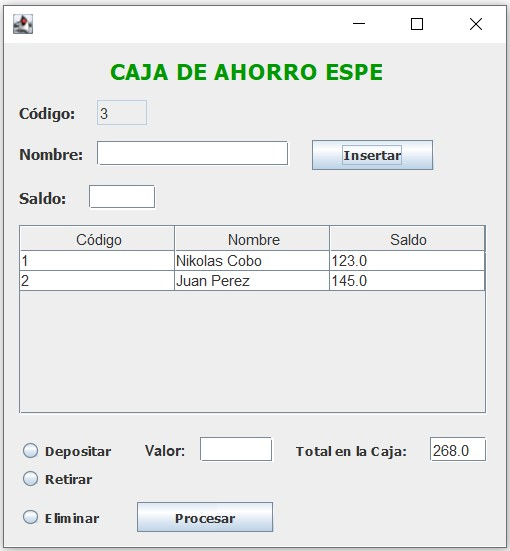

# SavingsBank
Ejemplo de una caja de ahorros with GUI - Example of a savings bank with GUI

En este ejemplo se presenta una caja de ahorros donde se tiene la opcion de agregar mas contribuyentes, la opción de depositar, retirar dinero y la opción de eliminar contribuyentes. Además en la celda de total se presenta el total de dinero que se encuentra en ese momento en la caja de ahorro.

This example shows a savings account where you have the option to add more contributors, the option to deposit, withdraw money and the option to delete contributors. In addition, the total amount of money currently in the savings account is shown in the total cell.

